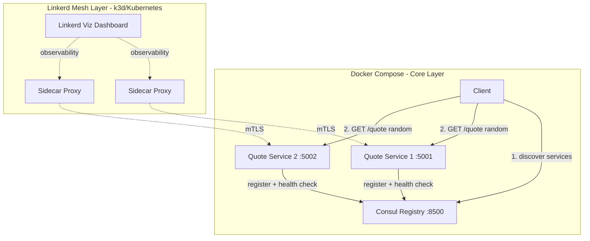

# CMPE 273 — Week 7: Naming, Service Discovery & Service Mesh

## Microservice Discovery with Marcus Aurelius Quote Service

A Python microservice system demonstrating **service registration & discovery** using HashiCorp Consul and **service mesh** capabilities using Linkerd. Two instances of a quote service register themselves with Consul, and a client discovers healthy instances at runtime and calls a random one.

---

## Architecture



---

## How It Works

1. **Two Flask service instances** (`quote-svc-1`, `quote-svc-2`) start up and register themselves with Consul via its HTTP API
2. **Consul** maintains a service registry and performs health checks (`GET /health`) every 10 seconds to track instance availability
3. **Client** queries Consul's catalog to discover all healthy instances, randomly selects one, and sends a `GET /quote` request
4. **Linkerd** (deployed on a local Kubernetes cluster via k3d) wraps each service with a sidecar proxy, adding automatic mTLS, traffic metrics, and observability — with zero application code changes

---

## Prerequisites

- Python 3.11+
- Docker & Docker Compose
- *(Optional, for service mesh)* k3d, kubectl, linkerd CLI

---

## Quick Start — Docker Compose

```bash
# Clone the repo
git clone https://github.com/yashashav-dk/cmpe273-week7-naming-service-discovery-assignment.git
cd cmpe273-week7-naming-service-discovery-assignment

# Start Consul, 2 quote service instances, and the client
docker compose up --build

# In another terminal — view Consul UI
open http://localhost:8500

# Test individual instances directly
curl http://localhost:5001/quote
curl http://localhost:5002/quote

# Tear down
docker compose down
```

### Expected Client Output

```
=== Marcus Aurelius Quote Service Client ===

Discovering services via Consul at consul...

Found 2 healthy instance(s): ['quote-svc-1', 'quote-svc-2']

[quote-svc-2] "The happiness of your life depends upon the quality of your thoughts."
  — Meditations, Book 5

[quote-svc-1] "Waste no more time arguing about what a good man should be. Be one."
  — Meditations, Book 10

[quote-svc-2] "Dwell on the beauty of life. Watch the stars, and see yourself running with them."
  — Meditations, Book 7

=== Done ===
```

---

## Service Mesh — Linkerd on k3d

The optional service mesh layer deploys the same services to a local Kubernetes cluster with Linkerd sidecar injection.

**Install prerequisites:**
```bash
# Install k3d (local K8s)
brew install k3d

# Install Linkerd CLI
brew install linkerd

# Verify
k3d version && linkerd version
```

**Deploy:**
```bash
# One-click setup: creates k3d cluster, installs Linkerd, deploys services
./k8s/linkerd-inject.sh

# Open Linkerd dashboard (shows live traffic, latency, success rates)
linkerd viz dashboard

# Port-forward Consul UI inside K8s
kubectl port-forward svc/consul 8500:8500

# Clean up
k3d cluster delete quote-mesh
```

### Service Mesh Benefits Demonstrated

| Benefit | What It Does | How to See It |
|---|---|---|
| **Traffic Routing** | Linkerd load-balances across meshed pods | Linkerd dashboard topology view |
| **Observability** | Request rate, success rate, p99 latency per instance | `linkerd viz stat` or dashboard |
| **Security** | Automatic mutual TLS between services | `linkerd viz edges` shows mTLS status |

---

## API Reference

### `GET /quote`

Returns a random Marcus Aurelius quote.

**Response:**
```json
{
  "quote": "You have power over your mind - not outside events. Realize this, and you will find strength.",
  "book": "Meditations, Book 6",
  "instance": "quote-svc-1"
}
```

The `instance` field identifies which service instance served the request — useful for verifying load distribution.

### `GET /health`

Health check endpoint used by Consul.

**Response:**
```json
{
  "status": "healthy"
}
```

---

## Service Discovery Flow

```
┌──────────┐         ┌──────────────┐         ┌──────────────┐
│  Client   │         │   Consul     │         │ Quote Svc 1  │
│           │         │  (Registry)  │         │  (Flask)     │
└─────┬─────┘         └──────┬───────┘         └──────┬───────┘
      │                      │                        │
      │   GET /v1/health/    │                        │
      │   service/quote-svc  │                        │
      │─────────────────────>│                        │
      │                      │                        │
      │  [quote-svc-1:5001,  │                        │
      │   quote-svc-2:5002]  │                        │
      │<─────────────────────│                        │
      │                      │                        │
      │  (pick random)       │                        │
      │                      │                        │
      │  GET /quote          │                        │
      │───────────────────────────────────────────────>│
      │                      │                        │
      │  {"quote": "...",    │                        │
      │   "instance": "..."}│                        │
      │<───────────────────────────────────────────────│
      │                      │                        │
```

---

## Project Structure

```
cmpe273-week7-naming-service-discovery-assignment/
├── docker-compose.yml              # Consul + 2 quote services + client
├── quote_service/
│   ├── app.py                      # Flask app with /quote and /health
│   ├── quotes.py                   # 20 Marcus Aurelius quotes from Meditations
│   ├── consul_registration.py      # Register/deregister with Consul (retry + backoff)
│   ├── run.py                      # Entrypoint: registration lifecycle + signal handlers
│   ├── Dockerfile
│   └── requirements.txt
├── client/
│   ├── client.py                   # Consul discovery + random instance selection
│   ├── Dockerfile
│   └── requirements.txt
├── k8s/
│   ├── consul.yaml                 # Consul Deployment + Service for K8s
│   ├── deployment.yaml             # Quote service Deployments with Linkerd annotations
│   ├── service.yaml                # K8s Service for quote-service
│   └── linkerd-inject.sh           # One-click k3d + Linkerd setup script
└── tests/
    ├── test_quotes.py              # Quote data validation
    ├── test_app.py                 # Flask endpoint tests
    ├── test_consul_registration.py # Registration/deregistration + retry tests
    └── test_client.py              # Discovery + service call tests
```

---

## Running Tests

```bash
pip install flask requests pytest
PYTHONPATH=. pytest tests/ -v
```

```
tests/test_app.py::test_health_returns_200 PASSED
tests/test_app.py::test_quote_returns_valid_json PASSED
tests/test_app.py::test_quote_returns_different_quotes PASSED
tests/test_client.py::test_discover_instances_parses_consul_response PASSED
tests/test_client.py::test_discover_instances_returns_empty_when_none_healthy PASSED
tests/test_client.py::test_call_quote_service_returns_json PASSED
tests/test_consul_registration.py::test_register_service_sends_correct_payload PASSED
tests/test_consul_registration.py::test_deregister_service_calls_correct_url PASSED
tests/test_consul_registration.py::test_register_retries_on_failure PASSED
tests/test_quotes.py::test_quotes_not_empty PASSED
tests/test_quotes.py::test_quote_has_required_fields PASSED
tests/test_quotes.py::test_get_random_quote_returns_valid_quote PASSED

12 passed
```

---

## Tech Stack

| Component | Technology |
|---|---|
| Microservice | Python 3.11+ / Flask |
| Service Registry | HashiCorp Consul |
| Service Mesh | Linkerd + Linkerd Viz |
| Containerization | Docker / Docker Compose |
| Local Kubernetes | k3d |

---

## Key Design Decisions

- **Consul HTTP API** for registration rather than a client library — keeps dependencies minimal and makes the discovery protocol explicit
- **Random instance selection** in the client demonstrates basic client-side load balancing
- **Graceful shutdown** via SIGTERM signal handler ensures services deregister from Consul when containers stop
- **Retry with exponential backoff** on registration handles the race condition where services start before Consul is ready
- **Linkerd on k3d** (separate from Docker Compose) because Linkerd requires Kubernetes for sidecar injection — the two layers demonstrate the same services with and without a mesh
