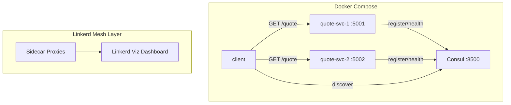

# Microservice Discovery — Marcus Aurelius Quote Service

A microservice system demonstrating **service discovery** with Consul and **service mesh** with Linkerd. Two instances of a quote service register with Consul, and a client discovers and calls random instances.

## Architecture



## How It Works

1. **Two Flask service instances** start and register themselves with Consul
2. **Consul** maintains a registry of healthy services via periodic health checks
3. **Client** queries Consul to discover available instances, picks one at random, and fetches a Marcus Aurelius quote
4. **Linkerd** (deployed on Kubernetes) adds automatic mTLS, traffic metrics, and observability

## Quick Start — Docker Compose (Core)

```bash
# Start Consul + 2 quote services + client
docker compose up --build

# View Consul UI
open http://localhost:8500

# Test individual instances
curl http://localhost:5001/quote
curl http://localhost:5002/quote

# Tear down
docker compose down
```

## Service Mesh — Linkerd on k3d

**Prerequisites:** Docker, k3d, linkerd CLI, kubectl

```bash
# Run the setup script
./k8s/linkerd-inject.sh

# Open Linkerd dashboard (traffic routing, observability, mTLS)
linkerd viz dashboard

# Port-forward Consul UI
kubectl port-forward svc/consul 8500:8500

# Clean up
k3d cluster delete quote-mesh
```

### Mesh Benefits Demonstrated

| Benefit | How |
|---|---|
| **Traffic Routing** | Linkerd load-balances across meshed pods, visible in dashboard |
| **Observability** | Request rate, success rate, latency per instance in Linkerd Viz |
| **Security** | Automatic mTLS between services — zero app code changes |

## API

### `GET /quote`
```json
{
  "quote": "You have power over your mind - not outside events. Realize this, and you will find strength.",
  "book": "Meditations, Book 6",
  "instance": "quote-svc-1"
}
```

### `GET /health`
```json
{"status": "healthy"}
```

## Project Structure

```
├── docker-compose.yml         # Core: Consul + 2 services + client
├── quote_service/
│   ├── app.py                 # Flask app (/quote, /health)
│   ├── quotes.py              # 20 Marcus Aurelius quotes
│   ├── consul_registration.py # Consul register/deregister
│   ├── run.py                 # Entrypoint with lifecycle mgmt
│   ├── Dockerfile
│   └── requirements.txt
├── client/
│   ├── client.py              # Consul discovery + random call
│   ├── Dockerfile
│   └── requirements.txt
├── k8s/
│   ├── deployment.yaml        # K8s deployments with Linkerd annotations
│   ├── service.yaml           # K8s service
│   ├── consul.yaml            # Consul on K8s
│   └── linkerd-inject.sh      # One-click mesh setup
└── tests/
    ├── test_quotes.py
    ├── test_app.py
    ├── test_consul_registration.py
    └── test_client.py
```

## Tech Stack

- Python 3.11+ / Flask
- HashiCorp Consul
- Linkerd + Linkerd Viz
- Docker / Docker Compose
- k3d (local Kubernetes)
