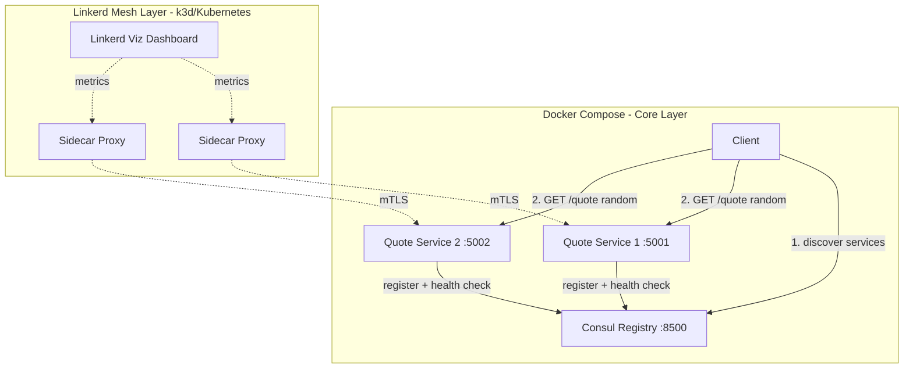

# Microservice Discovery Implementation Plan

> **For agentic workers:** REQUIRED: Use superpowers:subagent-driven-development (if subagents available) or superpowers:executing-plans to implement this plan. Steps use checkbox (`- [ ]`) syntax for tracking.

**Goal:** Build a Python microservice system with Consul-based service discovery and Linkerd service mesh, serving Marcus Aurelius quotes from two instances.

**Architecture:** Two Flask service instances register with Consul and serve quotes. A Python CLI client discovers healthy instances via Consul's HTTP API and calls a random one. The same services deploy to a k3d cluster with Linkerd for service mesh observability, mTLS, and traffic routing.

**Tech Stack:** Python 3.11+ / Flask, Consul, Linkerd, Docker, Docker Compose, k3d, kubectl

**Spec:** `docs/superpowers/specs/2026-03-15-microservice-discovery-design.md`

---

## Chunk 1: Quote Service Core

> **Note:** The spec uses `quote-service/` (hyphen) but Python cannot import directories with hyphens. All code uses `quote_service/` (underscore) throughout.

### Task 1: Quote Data Module

**Files:**
- Create: `quote_service/__init__.py`
- Create: `quote_service/quotes.py`
- Create: `tests/__init__.py`
- Create: `tests/test_quotes.py`

- [ ] **Step 1: Write the failing test**

```python
# tests/test_quotes.py
from quote_service.quotes import QUOTES, get_random_quote


def test_quotes_not_empty():
    assert len(QUOTES) >= 20


def test_quote_has_required_fields():
    for q in QUOTES:
        assert "text" in q
        assert "book" in q
        assert isinstance(q["text"], str)
        assert isinstance(q["book"], str)


def test_get_random_quote_returns_valid_quote():
    quote = get_random_quote()
    assert "text" in quote
    assert "book" in quote
    assert quote in QUOTES
```

- [ ] **Step 2: Run test to verify it fails**

Run: `cd /Users/spartan/jurisprudence/CMPE273/cmpe273-week7-naming-service-discovery-assignment && python -m pytest tests/test_quotes.py -v`
Expected: FAIL — `ModuleNotFoundError: No module named 'quote_service'`

- [ ] **Step 3: Write minimal implementation**

```python
# quote_service/quotes.py
import random

QUOTES = [
    {"text": "You have power over your mind - not outside events. Realize this, and you will find strength.", "book": "Meditations, Book 6"},
    {"text": "The happiness of your life depends upon the quality of your thoughts.", "book": "Meditations, Book 5"},
    {"text": "Waste no more time arguing about what a good man should be. Be one.", "book": "Meditations, Book 10"},
    {"text": "The best revenge is not to be like your enemy.", "book": "Meditations, Book 6"},
    {"text": "Accept the things to which fate binds you, and love the people with whom fate brings you together.", "book": "Meditations, Book 6"},
    {"text": "When you arise in the morning think of what a privilege it is to be alive, to think, to enjoy, to love.", "book": "Meditations, Book 5"},
    {"text": "It is not death that a man should fear, but he should fear never beginning to live.", "book": "Meditations, Book 8"},
    {"text": "Never esteem anything as of advantage to you that will make you break your word or lose your self-respect.", "book": "Meditations, Book 3"},
    {"text": "The soul becomes dyed with the colour of its thoughts.", "book": "Meditations, Book 5"},
    {"text": "Very little is needed to make a happy life; it is all within yourself in your way of thinking.", "book": "Meditations, Book 7"},
    {"text": "Loss is nothing else but change, and change is Nature's delight.", "book": "Meditations, Book 9"},
    {"text": "How much more grievous are the consequences of anger than the causes of it.", "book": "Meditations, Book 11"},
    {"text": "Dwell on the beauty of life. Watch the stars, and see yourself running with them.", "book": "Meditations, Book 7"},
    {"text": "The object of life is not to be on the side of the majority, but to escape finding oneself in the ranks of the insane.", "book": "Meditations, Book 6"},
    {"text": "Everything we hear is an opinion, not a fact. Everything we see is a perspective, not the truth.", "book": "Meditations, Book 4"},
    {"text": "If it is not right do not do it; if it is not true do not say it.", "book": "Meditations, Book 12"},
    {"text": "The impediment to action advances action. What stands in the way becomes the way.", "book": "Meditations, Book 5"},
    {"text": "Do not indulge in dreams of having what you have not, but reckon up the chief of the blessings you do possess.", "book": "Meditations, Book 7"},
    {"text": "Begin each day by telling yourself: Today I shall be meeting with interference, ingratitude, insolence, disloyalty, ill-will, and selfishness.", "book": "Meditations, Book 2"},
    {"text": "Look well into thyself; there is a source of strength which will always spring up if thou wilt always look.", "book": "Meditations, Book 7"},
]


def get_random_quote():
    return random.choice(QUOTES)
```

Also create `quote_service/__init__.py` and `tests/__init__.py` (both empty).

- [ ] **Step 4: Run test to verify it passes**

Run: `cd /Users/spartan/jurisprudence/CMPE273/cmpe273-week7-naming-service-discovery-assignment && PYTHONPATH=. python -m pytest tests/test_quotes.py -v`
Expected: 3 tests PASS

- [ ] **Step 5: Create .gitignore and .dockerignore**

```
# .gitignore
__pycache__/
*.pyc
.pytest_cache/
*.egg-info/
.env
```

```
# .dockerignore
.git/
tests/
docs/
__pycache__/
*.pyc
.pytest_cache/
.dockerignore
.gitignore
```

- [ ] **Step 6: Commit**

```bash
git add quote_service/ tests/ .gitignore .dockerignore
git commit -m "feat: add Marcus Aurelius quotes module with 20 quotes"
```

---

### Task 2: Flask App with /quote and /health

**Files:**
- Create: `quote_service/app.py`
- Create: `quote_service/requirements.txt`
- Create: `tests/test_app.py`

- [ ] **Step 1: Write the failing test**

```python
# tests/test_app.py
import json
import pytest
from quote_service.app import create_app


@pytest.fixture
def client():
    app = create_app(instance_name="test-instance")
    app.config["TESTING"] = True
    with app.test_client() as client:
        yield client


def test_health_returns_200(client):
    resp = client.get("/health")
    assert resp.status_code == 200
    data = json.loads(resp.data)
    assert data["status"] == "healthy"


def test_quote_returns_valid_json(client):
    resp = client.get("/quote")
    assert resp.status_code == 200
    data = json.loads(resp.data)
    assert "quote" in data
    assert "book" in data
    assert "instance" in data
    assert data["instance"] == "test-instance"


def test_quote_returns_different_quotes(client):
    quotes = set()
    for _ in range(50):
        resp = client.get("/quote")
        data = json.loads(resp.data)
        quotes.add(data["quote"])
    assert len(quotes) > 1  # not always returning the same quote
```

- [ ] **Step 2: Run test to verify it fails**

Run: `cd /Users/spartan/jurisprudence/CMPE273/cmpe273-week7-naming-service-discovery-assignment && PYTHONPATH=. python -m pytest tests/test_app.py -v`
Expected: FAIL — `ImportError: cannot import name 'create_app'`

- [ ] **Step 3: Write minimal implementation**

```python
# quote_service/app.py
import os
from flask import Flask, jsonify
from quote_service.quotes import get_random_quote


def create_app(instance_name=None):
    app = Flask(__name__)
    name = instance_name or os.environ.get("INSTANCE_NAME", "unknown")

    @app.route("/quote")
    def quote():
        q = get_random_quote()
        return jsonify({"quote": q["text"], "book": q["book"], "instance": name})

    @app.route("/health")
    def health():
        return jsonify({"status": "healthy"})

    return app


if __name__ == "__main__":
    port = int(os.environ.get("SERVICE_PORT", 5001))
    app = create_app()
    app.run(host="0.0.0.0", port=port)
```

```
# quote_service/requirements.txt
flask==3.1.0
requests==2.32.3
```

- [ ] **Step 4: Run test to verify it passes**

Run: `pip install flask requests && cd /Users/spartan/jurisprudence/CMPE273/cmpe273-week7-naming-service-discovery-assignment && PYTHONPATH=. python -m pytest tests/test_app.py -v`
Expected: 3 tests PASS

- [ ] **Step 5: Commit**

```bash
git add quote_service/app.py quote_service/requirements.txt tests/test_app.py
git commit -m "feat: add Flask app with /quote and /health endpoints"
```

---

### Task 3: Consul Registration Module

**Files:**
- Create: `quote_service/consul_registration.py`
- Create: `tests/test_consul_registration.py`

- [ ] **Step 1: Write the failing test**

```python
# tests/test_consul_registration.py
import json
from unittest.mock import patch, MagicMock
from quote_service.consul_registration import register_service, deregister_service


@patch("quote_service.consul_registration.requests.put")
def test_register_service_sends_correct_payload(mock_put):
    mock_put.return_value = MagicMock(status_code=200)
    register_service(
        consul_host="localhost",
        service_name="quote-service",
        instance_name="quote-svc-1",
        host="localhost",
        port=5001,
    )
    mock_put.assert_called_once()
    call_args = mock_put.call_args
    url = call_args[0][0]
    assert "/v1/agent/service/register" in url
    payload = json.loads(call_args[1]["data"])
    assert payload["Name"] == "quote-service"
    assert payload["ID"] == "quote-svc-1"
    assert payload["Port"] == 5001
    assert payload["Check"]["HTTP"] == "http://localhost:5001/health"


@patch("quote_service.consul_registration.requests.put")
def test_deregister_service_calls_correct_url(mock_put):
    mock_put.return_value = MagicMock(status_code=200)
    deregister_service(consul_host="localhost", instance_name="quote-svc-1")
    mock_put.assert_called_once()
    url = mock_put.call_args[0][0]
    assert "/v1/agent/service/deregister/quote-svc-1" in url


@patch("quote_service.consul_registration.time.sleep")
@patch("quote_service.consul_registration.requests.put")
def test_register_retries_on_failure(mock_put, mock_sleep):
    mock_put.side_effect = [ConnectionError, ConnectionError, MagicMock(status_code=200)]
    register_service(
        consul_host="localhost",
        service_name="quote-service",
        instance_name="quote-svc-1",
        host="localhost",
        port=5001,
    )
    assert mock_put.call_count == 3
    assert mock_sleep.call_count == 2
```

- [ ] **Step 2: Run test to verify it fails**

Run: `cd /Users/spartan/jurisprudence/CMPE273/cmpe273-week7-naming-service-discovery-assignment && PYTHONPATH=. python -m pytest tests/test_consul_registration.py -v`
Expected: FAIL — `ImportError: cannot import name 'register_service'`

- [ ] **Step 3: Write minimal implementation**

```python
# quote_service/consul_registration.py
import json
import time
import requests


def register_service(consul_host, service_name, instance_name, host, port, max_retries=3):
    url = f"http://{consul_host}:8500/v1/agent/service/register"
    payload = {
        "Name": service_name,
        "ID": instance_name,
        "Address": host,
        "Port": port,
        "Check": {
            "HTTP": f"http://{host}:{port}/health",
            "Interval": "10s",
            "Timeout": "5s",
        },
    }
    for attempt in range(max_retries):
        try:
            resp = requests.put(url, data=json.dumps(payload), headers={"Content-Type": "application/json"})
            resp.raise_for_status()
            print(f"[{instance_name}] Registered with Consul at {consul_host}")
            return
        except (requests.ConnectionError, requests.HTTPError) as e:
            if attempt < max_retries - 1:
                wait = 2 ** attempt
                print(f"[{instance_name}] Consul registration failed (attempt {attempt + 1}), retrying in {wait}s...")
                time.sleep(wait)
            else:
                raise RuntimeError(f"Failed to register with Consul after {max_retries} attempts: {e}")


def deregister_service(consul_host, instance_name):
    url = f"http://{consul_host}:8500/v1/agent/service/deregister/{instance_name}"
    try:
        resp = requests.put(url)
        resp.raise_for_status()
        print(f"[{instance_name}] Deregistered from Consul")
    except requests.RequestException as e:
        print(f"[{instance_name}] Warning: failed to deregister from Consul: {e}")
```

- [ ] **Step 4: Run test to verify it passes**

Run: `cd /Users/spartan/jurisprudence/CMPE273/cmpe273-week7-naming-service-discovery-assignment && PYTHONPATH=. python -m pytest tests/test_consul_registration.py -v`
Expected: 3 tests PASS

- [ ] **Step 5: Commit**

```bash
git add quote_service/consul_registration.py tests/test_consul_registration.py
git commit -m "feat: add Consul registration and deregistration with retry"
```

---

### Task 4: Wire Consul Registration into Flask App Startup/Shutdown

**Files:**
- Modify: `quote_service/app.py`
- Create: `quote_service/run.py` (entrypoint that wires registration + graceful shutdown)

- [ ] **Step 1: Create the entrypoint that handles registration lifecycle**

```python
# quote_service/run.py
import os
import signal
import sys
from quote_service.app import create_app
from quote_service.consul_registration import register_service, deregister_service

CONSUL_HOST = os.environ.get("CONSUL_HOST", "localhost")
INSTANCE_NAME = os.environ.get("INSTANCE_NAME", "quote-svc-1")
SERVICE_PORT = int(os.environ.get("SERVICE_PORT", 5001))
SERVICE_NAME = "quote-service"


def main():
    app = create_app(instance_name=INSTANCE_NAME)

    def shutdown_handler(signum, frame):
        print(f"\n[{INSTANCE_NAME}] Shutting down...")
        deregister_service(consul_host=CONSUL_HOST, instance_name=INSTANCE_NAME)
        sys.exit(0)

    signal.signal(signal.SIGTERM, shutdown_handler)
    signal.signal(signal.SIGINT, shutdown_handler)

    register_service(
        consul_host=CONSUL_HOST,
        service_name=SERVICE_NAME,
        instance_name=INSTANCE_NAME,
        host=INSTANCE_NAME,
        port=SERVICE_PORT,
    )

    app.run(host="0.0.0.0", port=SERVICE_PORT)


if __name__ == "__main__":
    main()
```

- [ ] **Step 2: Verify imports work**

Run: `cd /Users/spartan/jurisprudence/CMPE273/cmpe273-week7-naming-service-discovery-assignment && PYTHONPATH=. python -c "from quote_service.run import main; print('OK')"`
Expected: `OK`

- [ ] **Step 3: Commit**

```bash
git add quote_service/run.py
git commit -m "feat: add service entrypoint with Consul lifecycle management"
```

---

## Chunk 2: Client and Docker Compose

### Task 5: Client Discovery Script

**Files:**
- Create: `client/__init__.py`
- Create: `client/client.py`
- Create: `client/requirements.txt`
- Create: `tests/test_client.py`

- [ ] **Step 1: Write the failing test**

```python
# tests/test_client.py
from unittest.mock import patch, MagicMock
from client.client import discover_instances, call_quote_service


@patch("client.client.requests.get")
def test_discover_instances_parses_consul_response(mock_get):
    mock_get.return_value = MagicMock(
        status_code=200,
        json=lambda: [
            {
                "Service": {"ID": "quote-svc-1", "Address": "quote-svc-1", "Port": 5001},
                "Checks": [{"Status": "passing"}],
            },
            {
                "Service": {"ID": "quote-svc-2", "Address": "quote-svc-2", "Port": 5002},
                "Checks": [{"Status": "passing"}],
            },
        ],
    )
    instances = discover_instances("localhost")
    assert len(instances) == 2
    assert instances[0] == {"id": "quote-svc-1", "address": "quote-svc-1", "port": 5001}
    assert instances[1] == {"id": "quote-svc-2", "address": "quote-svc-2", "port": 5002}


@patch("client.client.requests.get")
def test_discover_instances_returns_empty_when_none_healthy(mock_get):
    mock_get.return_value = MagicMock(status_code=200, json=lambda: [])
    instances = discover_instances("localhost")
    assert instances == []


@patch("client.client.requests.get")
def test_call_quote_service_returns_json(mock_get):
    mock_get.return_value = MagicMock(
        status_code=200,
        json=lambda: {"quote": "Be one.", "book": "Meditations, Book 10", "instance": "quote-svc-1"},
    )
    result = call_quote_service({"address": "quote-svc-1", "port": 5001})
    assert result["quote"] == "Be one."
    assert result["instance"] == "quote-svc-1"
```

- [ ] **Step 2: Run test to verify it fails**

Run: `cd /Users/spartan/jurisprudence/CMPE273/cmpe273-week7-naming-service-discovery-assignment && PYTHONPATH=. python -m pytest tests/test_client.py -v`
Expected: FAIL — `ModuleNotFoundError: No module named 'client'`

- [ ] **Step 3: Write minimal implementation**

```python
# client/client.py
import os
import random
import time
import requests

CONSUL_HOST = os.environ.get("CONSUL_HOST", "localhost")


def discover_instances(consul_host):
    url = f"http://{consul_host}:8500/v1/health/service/quote-service?passing=true"
    try:
        resp = requests.get(url)
        resp.raise_for_status()
        services = resp.json()
        return [
            {
                "id": svc["Service"]["ID"],
                "address": svc["Service"]["Address"],
                "port": svc["Service"]["Port"],
            }
            for svc in services
        ]
    except requests.RequestException as e:
        print(f"Error discovering services: {e}")
        return []


def call_quote_service(instance):
    url = f"http://{instance['address']}:{instance['port']}/quote"
    resp = requests.get(url)
    resp.raise_for_status()
    return resp.json()


def main():
    print("=== Marcus Aurelius Quote Service Client ===\n")
    print(f"Discovering services via Consul at {CONSUL_HOST}...\n")

    # Retry discovery in case services are still registering
    instances = []
    for attempt in range(5):
        instances = discover_instances(CONSUL_HOST)
        if instances:
            break
        print(f"No instances yet (attempt {attempt + 1}/5), retrying in 3s...")
        time.sleep(3)

    if not instances:
        print("No healthy instances found after retries. Exiting.")
        return

    print(f"Found {len(instances)} healthy instance(s): {[i['id'] for i in instances]}\n")

    for i in range(5):
        instance = random.choice(instances)
        try:
            result = call_quote_service(instance)
            print(f"[{result['instance']}] \"{result['quote']}\"")
            print(f"  — {result['book']}\n")
        except requests.RequestException as e:
            print(f"[{instance['id']}] Error: {e}\n")
        if i < 4:
            time.sleep(1)

    print("=== Done ===")


if __name__ == "__main__":
    main()
```

```
# client/__init__.py
(empty file)
```

```
# client/requirements.txt
requests==2.32.3
```

- [ ] **Step 4: Run test to verify it passes**

Run: `cd /Users/spartan/jurisprudence/CMPE273/cmpe273-week7-naming-service-discovery-assignment && PYTHONPATH=. python -m pytest tests/test_client.py -v`
Expected: 3 tests PASS

- [ ] **Step 5: Commit**

```bash
git add client/ tests/test_client.py
git commit -m "feat: add client with Consul discovery and random instance selection"
```

---

### Task 6: Dockerfile for Quote Service

**Files:**
- Create: `quote_service/Dockerfile`

- [ ] **Step 1: Write the Dockerfile**

The build context is the repo root so `quote_service.*` imports work correctly.

```dockerfile
# quote_service/Dockerfile
FROM python:3.11-slim

WORKDIR /app

COPY quote_service/requirements.txt .
RUN pip install --no-cache-dir -r requirements.txt

COPY quote_service/ ./quote_service/

ENV PYTHONPATH=/app
ENV INSTANCE_NAME=quote-svc
ENV SERVICE_PORT=5001
ENV CONSUL_HOST=consul

CMD ["python", "-m", "quote_service.run"]
```

- [ ] **Step 2: Commit**

```bash
git add quote_service/Dockerfile
git commit -m "feat: add Dockerfile for quote service"
```

---

### Task 7: Docker Compose

**Files:**
- Create: `docker-compose.yml`

- [ ] **Step 1: Write docker-compose.yml**

```yaml
# docker-compose.yml
version: "3.8"

services:
  consul:
    image: hashicorp/consul:1.17
    ports:
      - "8500:8500"
      - "8600:8600/udp"
    command: agent -server -bootstrap-expect=1 -ui -client=0.0.0.0
    healthcheck:
      test: ["CMD", "consul", "members"]
      interval: 5s
      timeout: 3s
      retries: 5

  quote-svc-1:
    build:
      context: .
      dockerfile: quote_service/Dockerfile
    environment:
      - INSTANCE_NAME=quote-svc-1
      - SERVICE_PORT=5001
      - CONSUL_HOST=consul
    ports:
      - "5001:5001"
    depends_on:
      consul:
        condition: service_healthy

  quote-svc-2:
    build:
      context: .
      dockerfile: quote_service/Dockerfile
    environment:
      - INSTANCE_NAME=quote-svc-2
      - SERVICE_PORT=5002
      - CONSUL_HOST=consul
    ports:
      - "5002:5002"
    depends_on:
      consul:
        condition: service_healthy

  client:
    build:
      context: .
      dockerfile: client/Dockerfile
    environment:
      - CONSUL_HOST=consul
    depends_on:
      - quote-svc-1
      - quote-svc-2
```

- [ ] **Step 2: Create client Dockerfile**

```dockerfile
# client/Dockerfile
FROM python:3.11-slim

WORKDIR /app

COPY client/requirements.txt .
RUN pip install --no-cache-dir -r requirements.txt

COPY client/ ./client/

ENV PYTHONPATH=/app
ENV CONSUL_HOST=consul

# Sleep 5s to let services register, then run client
CMD ["sh", "-c", "sleep 5 && python -m client.client"]
```

- [ ] **Step 3: Verify compose config**

Run: `cd /Users/spartan/jurisprudence/CMPE273/cmpe273-week7-naming-service-discovery-assignment && docker compose config`
Expected: Valid YAML output with all 4 services

- [ ] **Step 4: Commit**

```bash
git add docker-compose.yml client/Dockerfile
git commit -m "feat: add Docker Compose with Consul, 2 quote services, and client"
```

---

### Task 8: End-to-End Smoke Test

- [ ] **Step 1: Start all services**

Run: `cd /Users/spartan/jurisprudence/CMPE273/cmpe273-week7-naming-service-discovery-assignment && docker compose up --build -d`

- [ ] **Step 2: Verify Consul has both services registered**

Run: `sleep 10 && curl -s http://localhost:8500/v1/health/service/quote-service?passing=true | python -m json.tool`
Expected: JSON array with 2 entries (quote-svc-1, quote-svc-2)

- [ ] **Step 3: Verify each instance responds**

Run: `curl -s http://localhost:5001/quote | python -m json.tool && curl -s http://localhost:5002/quote | python -m json.tool`
Expected: JSON with quote, book, and correct instance name for each

- [ ] **Step 4: Run the client**

Run: `docker compose logs client`
Expected: 5 quotes from a mix of instances

- [ ] **Step 5: Verify Consul UI**

Open `http://localhost:8500` in browser — should show `quote-service` with 2 healthy instances.

- [ ] **Step 6: Tear down**

Run: `docker compose down`

- [ ] **Step 7: Commit any fixes**

```bash
git add -A
git commit -m "fix: adjustments from end-to-end smoke test"
```

(Skip commit if no changes needed.)

---

## Chunk 3: Kubernetes and Linkerd Mesh

### Task 9: Kubernetes Manifests

**Files:**
- Create: `k8s/deployment.yaml`
- Create: `k8s/service.yaml`
- Create: `k8s/consul.yaml`

- [ ] **Step 1: Create Consul deployment for k8s**

```yaml
# k8s/consul.yaml
apiVersion: apps/v1
kind: Deployment
metadata:
  name: consul
  labels:
    app: consul
spec:
  replicas: 1
  selector:
    matchLabels:
      app: consul
  template:
    metadata:
      labels:
        app: consul
    spec:
      containers:
        - name: consul
          image: hashicorp/consul:1.17
          args: ["agent", "-server", "-bootstrap-expect=1", "-ui", "-client=0.0.0.0"]
          ports:
            - containerPort: 8500
---
apiVersion: v1
kind: Service
metadata:
  name: consul
spec:
  selector:
    app: consul
  ports:
    - port: 8500
      targetPort: 8500
```

- [ ] **Step 2: Create quote service deployment**

```yaml
# k8s/deployment.yaml
apiVersion: apps/v1
kind: Deployment
metadata:
  name: quote-svc-1
  labels:
    app: quote-service
spec:
  replicas: 1
  selector:
    matchLabels:
      app: quote-service
      instance: quote-svc-1
  template:
    metadata:
      labels:
        app: quote-service
        instance: quote-svc-1
      annotations:
        linkerd.io/inject: enabled
    spec:
      containers:
        - name: quote-service
          image: quote-service:local
          imagePullPolicy: Never
          env:
            - name: INSTANCE_NAME
              value: "quote-svc-1"
            - name: SERVICE_PORT
              value: "5001"
            - name: CONSUL_HOST
              value: "consul"
          ports:
            - containerPort: 5001
---
apiVersion: apps/v1
kind: Deployment
metadata:
  name: quote-svc-2
  labels:
    app: quote-service
spec:
  replicas: 1
  selector:
    matchLabels:
      app: quote-service
      instance: quote-svc-2
  template:
    metadata:
      labels:
        app: quote-service
        instance: quote-svc-2
      annotations:
        linkerd.io/inject: enabled
    spec:
      containers:
        - name: quote-service
          image: quote-service:local
          imagePullPolicy: Never
          env:
            - name: INSTANCE_NAME
              value: "quote-svc-2"
            - name: SERVICE_PORT
              value: "5001"
            - name: CONSUL_HOST
              value: "consul"
          ports:
            - containerPort: 5001
```

- [ ] **Step 3: Create Kubernetes service**

```yaml
# k8s/service.yaml
apiVersion: v1
kind: Service
metadata:
  name: quote-service
spec:
  selector:
    app: quote-service
  ports:
    - port: 80
      targetPort: 5001
```

- [ ] **Step 4: Commit**

```bash
git add k8s/
git commit -m "feat: add Kubernetes manifests for quote service and Consul"
```

---

### Task 10: Linkerd Injection Script

**Files:**
- Create: `k8s/linkerd-inject.sh`

- [ ] **Step 1: Write the injection and setup script**

```bash
#!/bin/bash
# k8s/linkerd-inject.sh
# Sets up k3d cluster, installs Linkerd, and deploys services

set -e

CLUSTER_NAME="quote-mesh"

echo "=== Step 1: Create k3d cluster ==="
k3d cluster create $CLUSTER_NAME --wait

echo "=== Step 2: Build and import Docker image ==="
docker build -t quote-service:local -f quote_service/Dockerfile .
k3d image import quote-service:local -c $CLUSTER_NAME

echo "=== Step 3: Install Linkerd ==="
linkerd check --pre
linkerd install --crds | kubectl apply -f -
linkerd install | kubectl apply -f -
linkerd check

echo "=== Step 4: Install Linkerd Viz extension ==="
linkerd viz install | kubectl apply -f -
linkerd viz check

echo "=== Step 5: Deploy Consul ==="
kubectl apply -f k8s/consul.yaml
echo "Waiting for Consul to be ready..."
kubectl wait --for=condition=ready pod -l app=consul --timeout=60s

echo "=== Step 6: Deploy Quote Services (with Linkerd injection) ==="
cat k8s/deployment.yaml | linkerd inject - | kubectl apply -f -
kubectl wait --for=condition=ready pod -l app=quote-service --timeout=60s

echo "=== Step 7: Deploy Kubernetes Service ==="
kubectl apply -f k8s/service.yaml

echo ""
echo "=== Deployment complete! ==="
echo ""
echo "View Linkerd dashboard:  linkerd viz dashboard"
echo "View Consul UI:          kubectl port-forward svc/consul 8500:8500"
echo "Test quote service:      kubectl port-forward svc/quote-service 8080:80"
echo ""
echo "To clean up:  k3d cluster delete $CLUSTER_NAME"
```

- [ ] **Step 2: Make executable**

Run: `chmod +x k8s/linkerd-inject.sh`

- [ ] **Step 3: Commit**

```bash
git add k8s/linkerd-inject.sh
git commit -m "feat: add Linkerd mesh setup script for k3d"
```

---

## Chunk 4: README and Final Polish

### Task 11: README with Mermaid Diagram

**Files:**
- Modify: `README.md`

- [ ] **Step 1: Write the full README**

```markdown
# Microservice Discovery — Marcus Aurelius Quote Service

A microservice system demonstrating **service discovery** with Consul and **service mesh** with Linkerd. Two instances of a quote service register with Consul, and a client discovers and calls random instances.

## Architecture



## How It Works

1. **Two Flask service instances** start and register themselves with Consul
2. **Consul** maintains a registry of healthy services via periodic health checks
3. **Client** queries Consul to discover available instances, picks one at random, and fetches a Marcus Aurelius quote
4. **Linkerd** (deployed on Kubernetes) adds automatic mTLS, traffic metrics, and observability

## Quick Start — Docker Compose (Core)

```bash
# Start Consul + 2 quote services + client
docker compose up --build

# View Consul UI
open http://localhost:8500

# Test individual instances
curl http://localhost:5001/quote
curl http://localhost:5002/quote

# Tear down
docker compose down
```

## Service Mesh — Linkerd on k3d

**Prerequisites:** Docker, k3d, linkerd CLI, kubectl

```bash
# Run the setup script
./k8s/linkerd-inject.sh

# Open Linkerd dashboard (traffic routing, observability, mTLS)
linkerd viz dashboard

# Port-forward Consul UI
kubectl port-forward svc/consul 8500:8500

# Clean up
k3d cluster delete quote-mesh
```

### Mesh Benefits Demonstrated

| Benefit | How |
|---|---|
| **Traffic Routing** | Linkerd load-balances across meshed pods, visible in dashboard |
| **Observability** | Request rate, success rate, latency per instance in Linkerd Viz |
| **Security** | Automatic mTLS between services — zero app code changes |

## API

### `GET /quote`
```json
{
  "quote": "You have power over your mind - not outside events. Realize this, and you will find strength.",
  "book": "Meditations, Book 6",
  "instance": "quote-svc-1"
}
```

### `GET /health`
```json
{"status": "healthy"}
```

## Project Structure

```
├── docker-compose.yml         # Core: Consul + 2 services + client
├── quote_service/
│   ├── app.py                 # Flask app (/quote, /health)
│   ├── quotes.py              # 20 Marcus Aurelius quotes
│   ├── consul_registration.py # Consul register/deregister
│   ├── run.py                 # Entrypoint with lifecycle mgmt
│   ├── Dockerfile
│   └── requirements.txt
├── client/
│   ├── client.py              # Consul discovery + random call
│   ├── Dockerfile
│   └── requirements.txt
├── k8s/
│   ├── deployment.yaml        # K8s deployments with Linkerd annotations
│   ├── service.yaml           # K8s service
│   ├── consul.yaml            # Consul on K8s
│   └── linkerd-inject.sh      # One-click mesh setup
└── tests/
    ├── test_quotes.py
    ├── test_app.py
    ├── test_consul_registration.py
    └── test_client.py
```

## Tech Stack

- Python 3.11+ / Flask
- HashiCorp Consul
- Linkerd + Linkerd Viz
- Docker / Docker Compose
- k3d (local Kubernetes)
```

- [ ] **Step 2: Commit**

```bash
git add README.md
git commit -m "feat: add README with Mermaid architecture diagram and full docs"
```

---

### Task 12: Run All Tests

- [ ] **Step 1: Run full test suite**

Run: `cd /Users/spartan/jurisprudence/CMPE273/cmpe273-week7-naming-service-discovery-assignment && PYTHONPATH=. python -m pytest tests/ -v`
Expected: All tests PASS (9 total)

- [ ] **Step 2: Fix any failures and commit**

```bash
git add -A
git commit -m "fix: test suite corrections"
```

(Skip if all passed.)

---

### Task 13: Push to GitHub

- [ ] **Step 1: Push all commits**

Run: `git push origin main`

- [ ] **Step 2: Verify on GitHub**

Check that the repo at `https://github.com/yashashav-dk/cmpe273-week7-naming-service-discovery-assignment` shows all files, README renders with Mermaid diagram.
