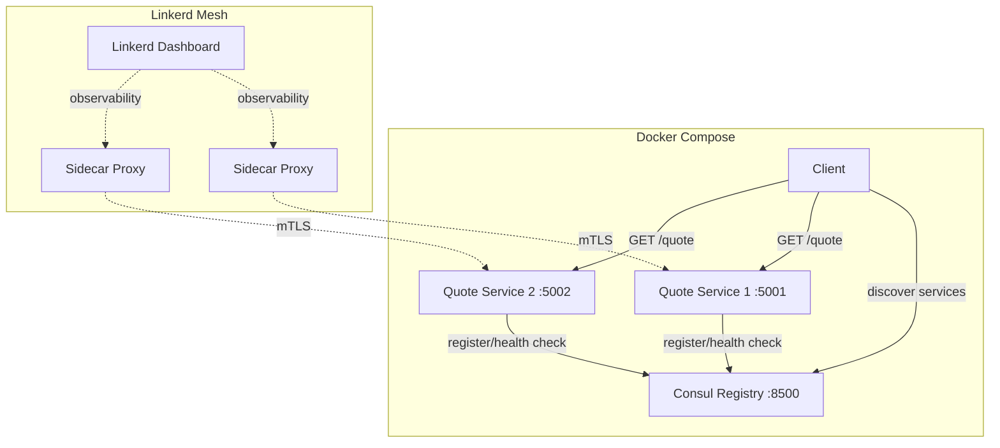

# Microservice with Service Discovery — Design Spec

## Overview

A Python-based microservice system demonstrating service discovery with Consul and service mesh with Linkerd. Two instances of a Marcus Aurelius quote service register with Consul, and a client discovers and calls random instances.

## Architecture



## Components

### 1. Quote Service (Flask)

**Endpoints:**
- `GET /quote` — returns random Marcus Aurelius quote as JSON: `{"quote": "...", "book": "...", "instance": "quote-svc-1"}`
- `GET /health` — returns `{"status": "healthy"}`

**Consul Registration:**
- On startup: registers via Consul HTTP API (service name, host, port, health check URL)
- On shutdown (SIGTERM): deregisters gracefully
- Health check: Consul pings `/health` every 10s

**Quote data:** ~20 hardcoded Marcus Aurelius quotes from Meditations in a Python module.

### 2. Client (Python CLI)

- Queries Consul HTTP API (`/v1/health/service/quote-service`) for healthy instances
- Randomly selects one instance
- Makes `GET /quote` request
- Prints quote and serving instance
- Runs 5 requests in a loop with short delay to demonstrate load distribution

### 3. Consul

- Service registry with web UI at `:8500`
- HTTP API for registration and discovery
- Health checks every 10s per service instance

### 4. Linkerd Service Mesh

- Control plane in Docker Compose
- Sidecar proxies injected into quote service containers
- Demonstrates:
  - **Traffic routing** — load balancing visible in dashboard
  - **Observability** — request rate, success rate, latency per instance
  - **Security** — automatic mTLS between services

## Project Structure

```
cmpe273-week7-naming-service-discovery-assignment/
├── README.md                  # Architecture diagram (Mermaid), setup, demo
├── docker-compose.yml         # Consul + 2 quote services + Linkerd
├── quote-service/
│   ├── Dockerfile
│   ├── app.py                 # Flask app with /quote and /health
│   ├── quotes.py              # Marcus Aurelius quotes data
│   ├── consul_registration.py # Register/deregister with Consul
│   └── requirements.txt
├── client/
│   ├── client.py              # Discovery + random instance selection
│   └── requirements.txt
└── linkerd/
    └── linkerd-config.yaml
```

## Error Handling

- Service can't reach Consul on startup: retry 3 times with backoff, then exit with error
- Client finds zero healthy instances: print error, exit gracefully
- Instance goes down: Consul health check fails, removes from catalog automatically

## Testing

- Quote service: `/quote` returns valid JSON with expected fields, `/health` returns 200
- Consul registration: service appears in catalog after startup, disappears after shutdown
- Client: handles zero healthy instances gracefully
- End-to-end: Docker Compose up, run client, confirm quotes from both instances

## Tech Stack

- Python 3.11+ / Flask
- Consul (HashiCorp)
- Linkerd
- Docker / Docker Compose

## Deliverables

- GitHub repo with all code
- Mermaid architecture diagram in README
- Demo video showing: services registering, Consul UI, client hitting both instances, Linkerd dashboard
